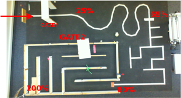

# Autonomous Vechile Challenge (AVC) Project

In groups of 4-5 people, we were tasked to develop and construct an autonomous 
vehicle capable of finding it's way through a pre-determined maze without 
human assistance. The time limit was small, the budget was tiny, and the [rules](Rules.md) 
were non-negotiable. It was designed to replicate a real-world experience and 
teach students to work in teams. 

## Maze

There are four sections to the maze (Quadrant [1](Quadrant%201), [2](Quadrant%202), [3](Quadrant%203), [4](Quadrant%204)). 

To follow a line, the robot must process the image in front of them, determine where the white line is, and control its wheels accordingly. 

To open the gate, the robot must recognise the wall in front of them, send a signal and wait for the wall to remove itself before continuing.

To move in a maze, the robot must use sensors to detect how far it is from the walls and control its wheels to stay in the middle of the corridor.

## Report

After finishing the vehicle, each member had to write a seperate report based 
on the AVC Project. This report had to be structured like an Engineering Report. 
